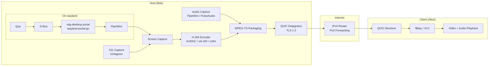

# Qup

A lightweight peer-to-peer screen-sharing tool. 

> [!NOTE]
> The code was written entirely by Claude Opus 4.6 with heavy steering and human feedbacks. 
> A human-written design file was provided to the agent with the main architecture and goals of the project.

It started as an experimental project to explore P2P networking using 
decentralized networks and DHT protocols. The initial goal was to have 2 peers 
exchange a perpetual InfoHash (just like a phone number), and then have 2 daemons
running in parallel that both announced and searched over the Bittorrent DHT for 
the other peer's Infohash. After finding each other's public IP address the 2 would 
have established a P2P connection via UDP hole punching but since most ISPs nowadays 
provide Symmetric NAT connections and other strict conditions like MAP-e, 
traversing was practically unreliable.

IPv6 would have been an alternative but adoption is still low, 
especially in Italy ([around ~21%](https://www.aelius.com/njh/google-ipv6/it.html)), 
and the unpredictability of relay servers or STUN/TURN overhead would have been against the initial goal. 

So the solution was just to rely on a direct IPv4 connection with minimal manual configuration.

It ended up being a super efficient way to share a screen/window.

## Performance
Tested over network with no streaming issues, no lag, no artifacts:
  * host:   300mb upload speed
  * client: 20mb download speed

### Host hardware configuration:
|  |  |
| --- | --- |
| **CPU** | Intel Core Ultra 7 258V |
| **GPU** | Intel ARC 140V |
| **RAM** | 32GB |
| **OS** | Fedora (Wayland) |
| **Throughput** | 1080p60 |

### Benchmark:
|  | Qup | Commercial (Zoom/Teams/Discord) |
| --- | --- | --- |
| **Transport** | **QUIC (via UDP)** | HTTPS/WebRTC (ICE/STUN/TURN) |
| **CPU (Host)** | **2% – 5%** | 10% – 50%+ | 
| **RAM (Host)** | **~30MB** | 200MB – 1GB+ | 
| **CPU (Viewer)** |  **~3%** | 15–30% (browser/app overhead) |
| **RAM (Viewer)** |  **~120MB** | 300–800+ MB |
| **Setup** | Manual (Port Forwarding) | Automated (STUN/TURN Servers) |
| **NAT Traversal** | None (Direct IP) | High (handles restrictive firewalls) |

Tested locally up to 4k 60fps with no issues.

---

## Features

*   ⚡ **QUIC protocol**: Streams video/audio payloads via QUIC Datagrams (utilizing `quic-go`).
*   🎮 **Per-App Audio Isolation**: Prompts users with active audio apps (queried via PipeWire/PulseAudio `pw-dump`) and creates a virtual null-sink to isolate and stream only the selected application's audio stream.
*   📺 **X11 & Wayland Dual Support**:
    *   **X11**: Direct screen capture via GStreamer (`ximagesrc`).
    *   **Wayland**: Native PipeWire capture using GStreamer (`pipewiresrc`) by establishing a D-Bus ScreenCast portal handshake powered by [wayland-portal-go](https://github.com/teotexe/wayland-portal-go).
*   🚀 **Hardware Acceleration**:
    *   NVIDIA NVENC (`nvh264enc`).
    *   Intel/AMD VA-API (`vah264enc`).
    *   Automatic fallback to (`x264enc`).


---

## System Requirements

> [!IMPORTANT]
> Qup utilizes direct IPv4 peer-to-peer connections.
> The host (Bob) must have an open port forwarded on their router to accept incoming client connections.
> Data is encrypted using TLS 1.3, as specified by the QUIC standard.

Ensure the following dependencies are installed on your Linux system:

### Host (Bob)
*   **OS**: Linux 
*   **Go** (v1.22 or higher)
*   **GStreamer** (required for capturing and encoding: `gst-launch-1.0`, `gst-plugins-base`, `gst-plugins-good`, `gst-plugins-bad`)
*   **PipeWire / PulseAudio** (for application audio capturing)
*   **pactl & pw-link** (for null sink creation and port mapping)

### Client (Alice)
*   **OS** Any
*   **ffplay** (included with standard FFmpeg installs) or **VLC** (fallback)

---

## Quick Start

### 1. Compile the Binaries
Clone the repository and build the host and client applications:
```bash
go build -o share cmd/share/share.go
go build -o connect cmd/connect/connect.go
```

### 2. Start the Host (Bob)
Bob is the sender sharing his screen. Start the host application on a port of choice (e.g., `50001`):
```bash
./share -port=50001
```
*Note: If running in a terminal, Qup will interactively prompt you to choose whether to share the default system audio or select a specific running application (like Firefox or Chrome) to capture audio from.*

### 3. Connect as the Client (Alice)
Alice is the receiver watching the stream. Connect by specifying Bob's target IP and port:
```bash
./connect [BOB_IP]:50001
```

---

## Known Issues
  * **VA-API Aspect Ratio Stretching**: When utilizing Intel/AMD hardware-accelerated encoding (vah264enc), sharing a window that has been  dynamically resized may cause the output image to stretch abnormally to fit the target resolution. This behavior stems from an upstream driver limitation with specific VA-API implementations. 
    * Workaround: Maintain standard aspect ratio dimensions or fallback to software encoding (-codec=x264enc).

---

## CLI Flag References

### 1. Host (`share`)

| Flag | Type | Default | Description |
| :--- | :--- | :--- | :--- |
| `-port` | `int` | `50001` | UDP port to listen on for incoming client QUIC connections. |
| `-bitrate` | `int` | `8000` | Target video bitrate in kbps (e.g., `8000` = 8 Mbps). |
| `-fps` | `int` | `60` | Captured frame rate. A value of `60` offers buttery smooth streams. |
| `-size` | `string` | `"1920x1080"` | Capture resolution width x height. |
| `-codec` | `string` | `"auto"` | GStreamer H.264 encoder element (e.g. `x264enc`, `vah264enc`, `nvh264enc`). Auto-probes hardware acceleration by default. |
| `-g` | `int` | `30` | GOP size. Small default is crucial for instant client startup sync. |
| `-preset` | `string` | `"ultrafast"` | x264 software encoder speed preset (e.g., `ultrafast`, `veryfast`, `medium`). |
| `-tune` | `string` | `"zerolatency"` | x264 software encoder latency tuning mode. |
| `-volume` | `float` | `150.0` | Audio volume amplification factor. |
| `-audio-app`| `string` | `""` | App name to capture audio from (bypasses interactive prompt). |
| `-display` | `string` | `$DISPLAY` | X11 display string (only applicable in X11 environments). |
| `-test` | `bool` | `false` | Synthetic mode using GStreamer's `videotestsrc` and `audiotestsrc` instead of capturing screen. |
| `-mock-portal`| `bool`| `false` | Simulates a mock ScreenCast portal in background (for testing). |
| `-headless` | `bool` | `false` | Bypasses physical capture and uses synthetic GStreamer test sources. |
| `-debug` | `bool` | `false` | Prints verbose shell command lines, encoders, and network output metrics. |

### 2. Client (`connect`)

| Flag | Type | Default | Description |
| :--- | :--- | :--- | :--- |
| `-probesize` | `int` | `5000000` | ffplay buffer size in bytes to probe streams. |
| `-analyze-duration` | `int` | `2000000` | Duration (in microseconds) to analyze stream properties before displaying. |
| `-low-delay` | `bool` | `true` | Tells the player to ignore standard container synchronization buffers. |
| `-framedrop` | `bool` | `true` | Drop late video frames if decoding lags behind. Prevents stream drift. |
| `-hwaccel` | `string` | `"vaapi"` | Hardware-accelerated decoding method (options: `vaapi`, `none`). |
| `-hwaccel-device` | `string` | `"/dev/dri/renderD128"` | Device render node used for hardware decoding. |
| `-loglevel` | `string` | `"warning"` | Verbosity of the player logs (`quiet`, `error`, `warning`, `info`, `debug`). |
| `-test` | `bool` | `false` | Headless client mode. Measures network packet receipt without spawning a GUI window. |

---

## Premium Tuning Recipes

### 1. High-Performance GPU Capture & Encode (Default Wayland)
If running on a modern Wayland desktop environment with an Intel, AMD, or NVIDIA GPU, starting Bob with default options will automatically activate GStreamer-native hardware GPU capture and encoding:
```bash
./share
```

### 2. High-Quality LAN Mode (High Bandwidth)
If streaming over a high-speed local network or fiber link, you can push the quality to the absolute limit by raising the target bitrate:
```bash
./share -bitrate=15000 -size=1920x1080 -fps=60
```

### 3. Lower Bandwidth Mode (Mobile Hotspot / Poor Wi-Fi)
If Bob's upload connection is constrained, reduce the framerate and lower the target bitrate to maintain smoothness:
```bash
./share -bitrate=3000 -fps=30 -preset=veryfast
```

---

## Verification & Automated Testing

Qup includes a self-contained integration test suite to verify pipeline construction and end-to-end communication loopbacks:

```bash
./verify.sh
```

The script builds both binaries, sets up a temporary local D-Bus bus, and executes loopback streaming under headless X11 and Wayland (using the mock ScreenCast portal).
